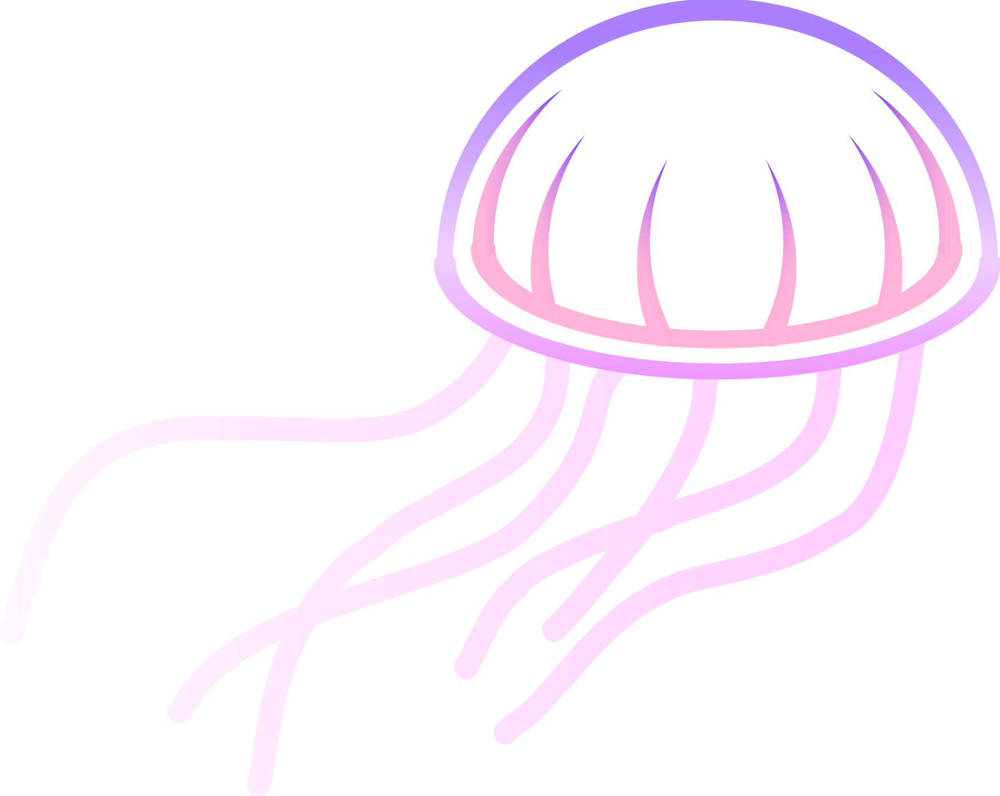
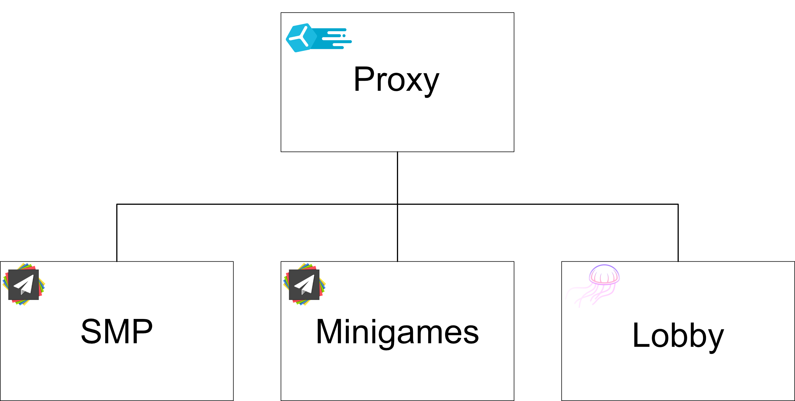

<div align="center">

<a href="https://serlith.net">
  
</a>

## 🪼 Jellyfish 🪼
Jellyfish is a [Paper](https://github.com/PaperMC/Paper)/[Pufferfish](https://github.com/pufferfish-gg/Pufferfish/) fork designed for <u>**Network Lobbies**</u>. \
**This fork <u>WILL</u> introduce breaking changes, it is only recommended for <u>Lobbies</u>, not for SMP or Minigames.**

</div>

## Use case
Jellyfish was designed for lobbies, as such is not intended to work as a standalone server software and should always be running behind a proxy. \
As it is based on Paper, it allows using already existing plugins for Spigot/Paper. \
If you have the time and resources to develop/port your existing software to another platform, an even better alternative to this project would be [Minestom](https://minestom.net/).

<div align="center">

</div>

## Ideas
Since most of the features in a Paper server can already be disabled via config files, the core ideas behind Jellyfish are:
1. Provide a proper default config
2. Save some extra performance by allowing to toggle more features that are not always going to be use and can't be toggled in Paper (if any)
3. Reduce the jar size by **completely removing** features that are definitely not going to be used
4. Probably add a couple of features that make easier to handle legacy players

Since this project is not meant to be constantly updated to the latest minor/major release, another advantage of changing the default config files is to facilitate migration to other forks if an up-to-date version is needed.

Some examples of the difference between features that can be disabled and features that will be removed.

| Example Feature           | Expected action     | Reason                                          |
|---------------------------|---------------------|-------------------------------------------------|
| Block breaking            | Disabled by default | Most lobbies don't need block breaking          |
| Mobs spawning with AI     | Disabled by default | Most plugins that spawn mobs don't use their AI |
| Hunger and Health ticking | Disabled by default | Most lobbies don't use/need this mechanic       |
| Terrain generation        | Removed             | Lobbies use void worlds                         |
| Natural mob spawning      | Removed             | Lobbies don't need mobs spawning around         |

## TODO
1. Remove terrain generation logic
2. Remove nether and end dimension generation logic
3. Remove global attack cooldown (For ~1.8 players)
4. Modify void height (For <1.16 players)
5. Toggle mob AI by default
6. Toggle health and hunger consumption
7. Toggle block breaking

Features will slowly be removed/added as my time allows

## License
All patches are licensed under the MIT license.

[](LICENSE)

See [PaperMC/Paper](https://github.com/PaperMC/Paper), and [PaperMC/Paperweight](https://github.com/PaperMC/paperweight) for the license of material used by this project.

## Building and setting up

#### Initial setup
First, <u>clone</u> this repository. Do not download it.

Then run the following command in the root directory:

```
./gradlew applyAllPatches
```

The project is now ready for use in your IDE.

#### Creating a patch

See [CONTRIBUTING.md](CONTRIBUTING.md).

#### Compiling

Use the command `./gradlew build` to build the API and server. Compiled JARs
will be placed under `jellyfish-api/build/libs` and `jellyfish-server/build/libs`.
**These JARs are not used to start a server.**

To compile a server-ready paperclip jar, run `./gradlew createMojmapBundlerJar`.
To install the `jellyfish-api` and `jellyfish` dependencies to your local Maven repo, run `./gradlew publishToMavenLocal`. The compiled paperclip jar will be in `jellyfish-server/build/libs`.

# Support
This project is designed for Serlith Network, so support is currently not guaranteed until we can find someone to properly maintain the project.

# Credits:

1. PaperMC Team
2. Pufferfish Team, even if this is not a direct Pufferfish fork, we will use patches that make sense to use in a lobby.
3. PurpurMC Team, even if this is not a direct Purpur fork, we do use their paperweight project setup.

